## Hi there 👋

#### 📊 GitHub Stats

<!-- profile/stats.svg, profile/top-langs.svg 는 GitHub Actions가 자동 생성합니다 -->
<!-- .github/workflows/readme_stats.yml 참고 -->

---

*"기술은 사람을 위해 존재합니다"*

<!--
**hyoungsD/hyoungsD** is a ✨ _special_ ✨ repository because its `README.md` (this file) appears on your GitHub profile.

Here are some ideas to get you started:

- 🔭 I’m currently working on ...
- 🌱 I’m currently learning ...
- 👯 I’m looking to collaborate on ...
- 🤔 I’m looking for help with ...
- 💬 Ask me about ...
- 📫 How to reach me: ...
- 😄 Pronouns: ...
- ⚡ Fun fact: ...
-->

